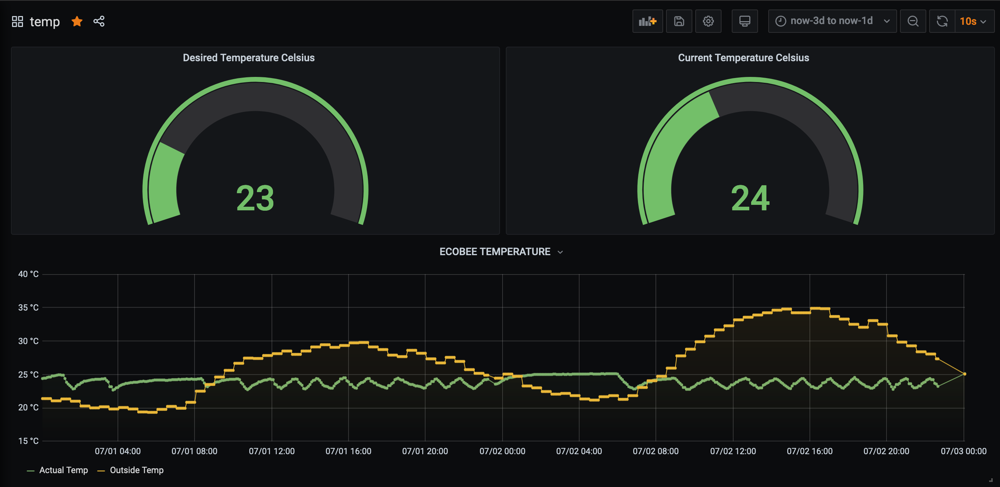
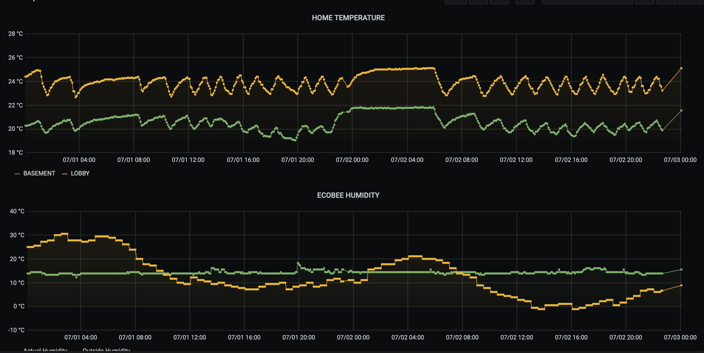
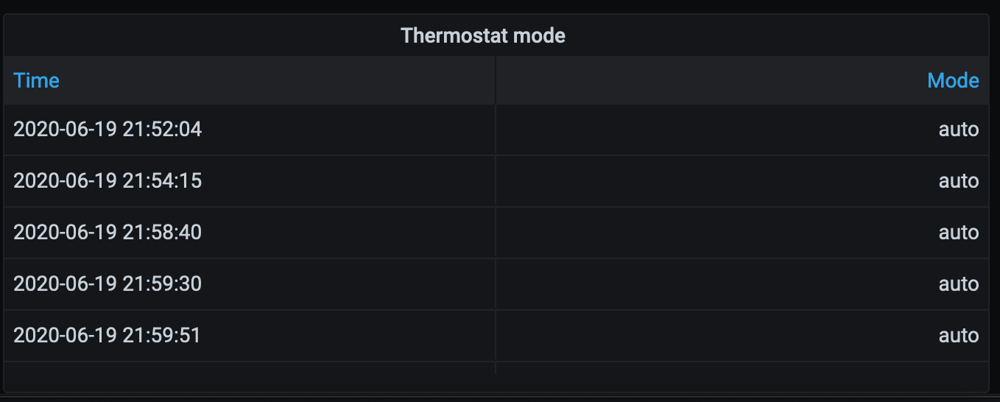
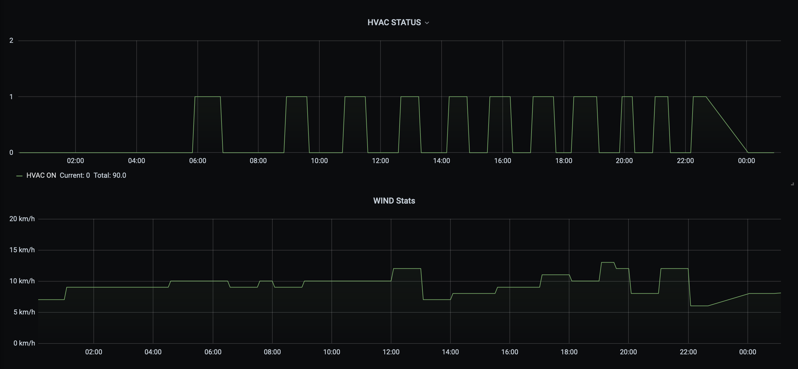
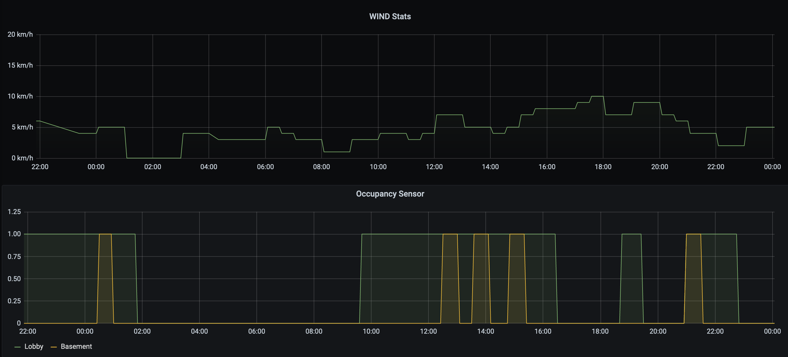

# ecobee_poller
This repository helps with visibility into working of Ecobee Smart themostat.

* Stats are pulled from Ecobee API and indexed into InfluxDB, with Grafana Dashboard.
* Ecobee-poller Dockerized version and update stats every 5 min.
* Pre-requisites:
  * Docker / Docker-compose is in running state
  * Influxdb setup
  * Grafana setup
  * API and Refresh Token setup
    * https://www.ecobee.com/home/developer/api/examples/ex1.shtml  


## To begin with install and run process:
```
git clone https://github.com/hsgurm1/ecobee_poller.git
cd ecobee_poller/docker/
vi Dockerfile
--- Update the ENV values for below ---
ENV APIValue="enter-your-api-value-here"
ENV influxdb_server_value='influx_db_server_ip'
ENV influxdb_port_value=8086
ENV influxdb_database_value='ecobee'
---------------------------------------
docker build -t ecobee_poller:latest .
docker run -it -d ecobee_poller:latest
```

## Stats will be pulled every 5 min. You can check current stats below;
```
docker logs --follow container-name
```

## Example output:
```
2020-07-04 03:19:31,197 - ecobee - DEBUG - Initiated Ecobee poller at 2020-07-04 03:19:30.643818
2020-07-04 03:19:31,540 - ecobee - DEBUG - sensor readings written: 1
2020-07-04 03:19:31,540 - ecobee - DEBUG - -----------------------------------
Next run in 5 min
2020-07-04 03:19:31,540 - ecobee - DEBUG - -----------------------------------
2020-07-04 03:24:32,173 - ecobee - DEBUG - Initiated Ecobee poller at 2020-07-04 03:24:31.711358
2020-07-04 03:24:32,677 - ecobee - DEBUG - sensor readings written: 1
2020-07-04 03:24:32,698 - ecobee - DEBUG - -----------------------------------
```
## GRAFANA Stats

<div align="center">
    
    
    
    
    
</div>

## Reference
* https://github.com/matisku/tig-stack
* https://www.ecobee.com/home/developer/api/introduction/index.shtml
* https://github.com/thedancannon/ecobee_influxdb
* https://www.ecobee.com/home/developer/api/examples/ex1.shtml
